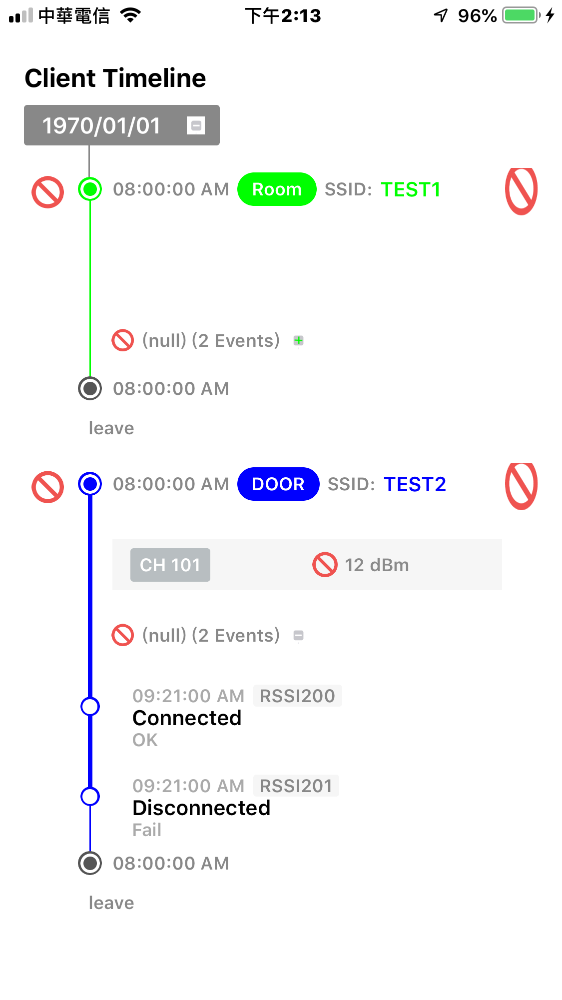

# IRExpandableTableView

- IRExpandableTableView is a powerful expandable tableview for iOS.

## Features
- Expandable tableview with nested.
- Easy to customize. Easy to management.
- Nice stucture.
- Has a demo project.

## Install
### Git
- Git clone this project.
- Copy `Class` amd `Utility` folders into your own project.
- See how to use it in `README` or `ViewController.m`.

### Cocoapods
- Not support yet.

## Usage

### Basic
- Set Branch
``` objective-c
#import "TimelineManager.h"

...

Branch *branch = [[TimelineManager sharedInstance] branchFromClientJourneyData:_clientJourneyData];
branch.tableView = self.timelineTableView;
branch.delegate = self;

[self.timelineTableView reloadDataWithCompletion:^{
    [self.delegate didUpdate:nil];
}];
```

- Set Delegate
``` objective-c
#import "TimelineManager.h"

...

@interface MonitorClientsDetailTimelineTableViewCell ()<BranchDelegate>

...

- (void)willUpdate:(NSNumber *)pos {
    [self.delegate willUpdate:pos];
}

- (void)didUpdate:(NSNumber *)pos {
    [self layoutIfNeeded];
    
    [self.delegate didUpdate:pos];
}

```

### Advance
- Please see the demo project.

## Screenshots



